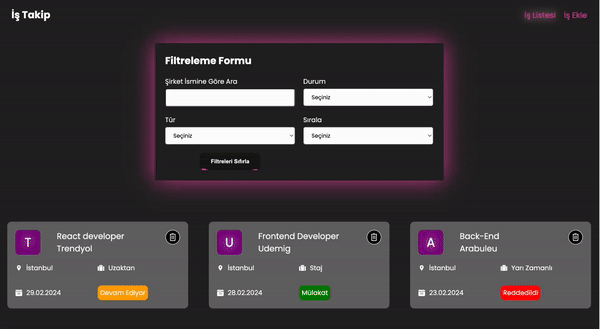

<h1>Toolkit Job App</h1>
Redux Toolkit Job App is a job application management application built using modern web development technologies. This application combines the power of React.js and the convenience of Redux Toolkit to enable users to organize, filter, and manage their job applications.

<h3>Features</h3>

- React-router-dom
  -Axios
  -Sass
  -React-Toastify
  -Json-server
  -React-redux
  -@reduxjs/toolkit
  -React icons
  -uuid

<h3>Screenshot</h3>

